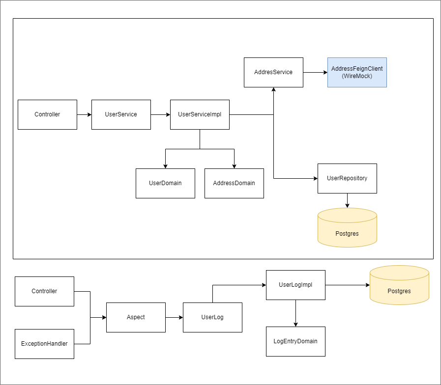

# User Registration API

API para cadastro de usuários, protegida por autenticação JWT, com persistência em banco de dados PostgreSQL e documentação em Swagger. Inclui uma simulação da API de consulta de CEPs com WireMock.

## Desenho de solução



## Pré-requisitos

* **Java 17** (a aplicação roda em contêiner, então o usuário final não precisa ter o Java instalado localmente)
* **Docker** e **Docker Compose**

## Configuração

### Passo 1: Compilação

Na raiz do projeto, execute o comando abaixo para compilar o projeto e instalar as dependências Maven:

````
mvn clean install
````

### Passo 2: Inicializar Dependências no Docker

Para iniciar a aplicação e seus serviços dependentes, utilize o Docker Compose:

````
docker-compose up -d --build
````
Este comando irá:

* Criar um contêiner para a aplicação Java, garantindo que ela rode com a versão correta (Java 17), mesmo sem instalação local.
* Subir um contêiner PostgreSQL configurado como banco de dados para persistência.
* Subir um contêiner WireMock para simular a API de consulta de CEPs (API ViaCEP).

### Passo 3: Configuração do Banco de Dados e Mock de API

1. **PostgreSQL:**
* O banco de dados está configurado no ```docker-compose.yml``` e será automaticamente provisionado ao iniciar o Docker.
* O nome do banco de dados, usuário e senha podem ser configurados diretamente no ```docker-compose.yml```.

2. **WireMock:**
* O WireMock está configurado para responder às consultas de CEP conforme especificado nos arquivos de mapeamento JSON dentro da pasta ```wiremock/mappings```.
* Você pode acessar a interface de administração do WireMock para visualizar ou gerenciar os mocks criados em ```http://localhost:8089/__admin/```.

CEPs mockados
````
00000000
01010101
02020202
````

### Documentação com Swagger

A API possui documentação Swagger, o que facilita a visualização e o teste dos endpoints.

1. Após iniciar a aplicação, acesse a interface Swagger no navegador:
```http://localhost:8080/swagger-ui/index.html```
2. Nesta página, você pode explorar e testar os endpoints disponíveis diretamente pela interface Swagger.

### Autenticação

Os endpoints da API são protegidos por autenticação JWT. Para obter o token JWT necessário para acesso aos endpoints, siga o passo abaixo:

1. Faça login com uma chamada POST no endpoint ```/api/login```.
2. Use o token JWT retornado no cabeçalho de autorização (```Authorization: Bearer <token>```) para acessar os endpoints protegidos.

## Endpoints

### Cadastro e Gerenciamento de Usuários
* #### Criar Usuário
```POST localhost:8080/api/users```

* #### Obter Usuário por ID
```GET localhost:8080/api/users/{id}```

* #### Listar Usuários com Paginação
```GET localhost:8080/api/users?page=1&size=3```

* #### Atualizar Usuário
```PUT localhost:8080/api/users```

* #### Excluir Usuário
```DELETE localhost:8080/api/users/{id}```

### Consulta de CEP (usando WireMock)
* #### Consultar CEP
```GET localhost:8089/ws/{cep}/json```

O serviço de consulta de CEP é simulado com o WireMock, retornando dados específicos configurados no contêiner.

## Testes
O projeto utiliza uma abordagem de testes completa com as seguintes ferramentas:

* **JUnit 5:** framework principal para execução dos testes.
* **Mockito:** para simular dependências e comportamentos em testes unitários.
* **MockMvc:** para testes de controladores Spring, simulando requisições HTTP e verificando o comportamento dos endpoints da API.
Os testes são configurados para garantir a qualidade e funcionalidade da aplicação.

## Tecnologias
* Java 17
* Spring Boot
* JWT para segurança
* Swagger para documentação da API
* PostgreSQL como banco de dados
* WireMock para simulação de APIs
* Docker e Docker Compose para contêineres
* JUnit 5, Mockito e MockMvc para testes